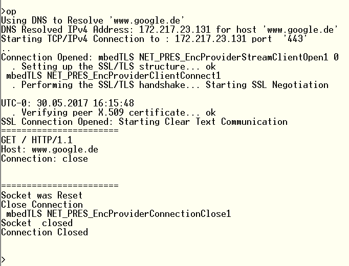

# mbedTLS
Shows how to use mbedTLS with Microchips Harmony Framework 2.04 on a PIC32MZ2048EFH144 Ethernet Starterkit with console interface on UART2 (routed to MCP2221 Chip)

In this version only the mbedTLS source codes are avaiable. No WolfSSL is used in this version. 

- the used Hardware is the PIC32MZ2048EFH144 Ethernet Starterkit with the MCP2221 UART CDC-USB. 
  The real UART2 of the PIC is used for debugging and is connected to the MCP2221. 
- The Command "op" in the Terminal starts a TLS connection to https://www.googl.de. Read data, print them and closes. 
- Works with Harmony 2_04
- The Heap Managment is currently very wastefully adjusted. Should be alingned to the needs of the actual application.

Place it into ~/microchip/harmony/<VERSION>/apps\/tcpip/xxxx 
 
The MbedTLS is under Apache 2.0 licence (Open sSurce) and it is expressly allowed to use it on a non-ARM core. See https://tls.mbed.org/ 
For redistribution, we have to ask the MbedTLS people for review first. But it should be possible to add it to Harmony. 
 
Both TLS library source codes are within this project. That’s why I cannot say what the current code footprint is. But MbedTLS  seems to be very similar to WolfSSL.

I used the Network Presentation layer to hide the TLS and did the most work in “net_pres_enc_glue.c

MbedTLS: The heap is in idle at 221008 Bytes and peak level of 269456. I.e. 48448 Bytes => 47kB
WolfSSL: The heap is in idle at 216848 Bytes and peak level of 257960. I.e. 41112 Bytes => 40kB 
 
The stats command show for WolfSSL and MbedTLS:
 
 
|         | WolfSSL    |mbedTLS |
| --------|---------|-------|
| Raw Bytes Txed | 0   | 0  |
| Raw Bytes Rxed | 45868  | 45152
| Clear Bytes Txed | 58     | 58
| Clear Bytes Rxed | 45868  | 45868 
| DNS Lookup Time | 10ms   | 15ms
| Time to Start TCP Connection | 510ms  | 510ms
| Time to Negotiate SSL Connection | 380ms  | 645ms
| Time to till first packet from server | 116ms  | 79ms
| Time for last packet from server | 1072ms | 2503ms

Memory Footprint:

|          |Flash   | RAM   |
| ---------|--------|-------|
| WolfSSL  |330704  |369136 |
| mbedTLS8 | 516168 |374904 |

It was crucial to change to FreeRTOS. This makes the whole Ethernet programming much easier. You can use blocking code. The MbedTLS expects that the read/write socket functions are blocking!
 
I have added  a epoch_to_date_time() function that he NTP UTC timestamp can be converted to Date and Time. This was necessary because the MbedTLS library checks the expiration dates of the peers certificate. 
 
Because the USB CDC for debugging prints is annoying, I have changed it the UART2.
 
All heap functions were routed to the FreeRTOS Heap 4 function set because of thread safety.
 
Supplementing the memory footprints for the complete project. 

The source codes for the different libraries are respectively excluded.    

Compiler optimization is –O1
The heap size is set in FreeRTOS config with 350000 Bytes. With peak 269456 (MbedTLS) and 257960 (WolfsSL), the heap size could be reduced by ~50kB down to ~300kB.
 
In mbedTLS all cipher suites are enabled by default. There is still room for memory savings.

Here some other messages from my local git repository what I have done:

	- Connections works with mbedTLS
	- Timeouts added
	- time and heap command added
	- mbedTLS expects blocking read and write functions. NET Presentation layer is now blocking for mbedTLS.
	- hange to FreeRTOS
	· Changed from USB CDC to UART2 
	· Debug prints added in exception handler
	· FreeRTOS Added
	· Test Project ssl_client1.c connects successfully to thethingnetworks.org
	· Added: TTN_Gateway/firmware/src/unistd.h
	· PIC32MZ conditional compiling added and Pseudo Random Function added
	· Core Counter Read Function added for timing
	· File read Function excluded with conditional compiling __PIC32MZ
	· Reformatted for pretty looking
	· mbedtls context struct
	· send and receive callback functions for mbedtls
	· certain function for security provider mbedtls added
	· TLB Exception debug print added
	· GetHostName function added for certificate check
	· receive callback function is now blocking. To enable this, the TCP stack is running in it's own task.
	· Time functions are added. could be avoid but neccessary for peer certificate check.
	· Security Provider mbedtls added.
	· print flag added. Debug print starts only after the RTOS scheduler is started. After every debug print, the task is delayed by 20ms to ensure complete printing.
	· FreeRTOS heap size extended from 280000 to 340000.
	· command added: show heap current and max
	· Show Heap command added
	· Print Heap Funktion for debugging added
	· All X_init functions are called once during NET Pres Init function
	· Server Public certificate added to chain at NET Pres Init function
	· Only mbedtls_ssl_free is the only free function called durring closing the connection
	· Only mbedtls_ssl_setup() is called during open function
	· Project changes committed to remote repo
	· Buffer Handling fixed
	· critical Bug fixed, that killed the linked list in the heap
	· mbeTLS Buffer Hanlding works good. But ponly the first TLS Acces works always. The Second access during runtime seems to still have trouble with Internal buffer handling. This is about reinitializing an TLS connections during runtime.

